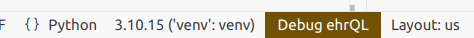
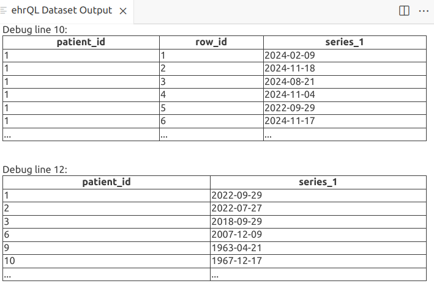

## What is dummy data?

Dummy data (in the context of OpenSAFELY) is data that mimics the output of a dataset produced by running an ehrQL generate-dataset action, in the absence of the real data. It allows you to test and develop your analyses without access to the real data.

When you run an ehrQL command or a `project.yaml` action locally (i.e. outside of the secure 
environment where real patient data lives), ehrQL allows the action to run using simulated data, either
data generated by ehrQL itself, data that you provide. 

## Using dummy data in OpenSAFELY

There are 3 ways to use dummy data:

1. Allow ehrQL to generate a dummy dataset from your dataset definition
1. Provide your own dummy tables
1. Provide your own dummy dataset


### Generate a dummy dataset with ehrQL

:fontawesome-solid-code: `analysis/dataset_definition.py`

This example is a very minimal dataset definition, which finds patients between
18 and 80, and adds their age and sex to the output dataset:

```py
from ehrql import create_dataset
from ehrql.tables.core import patients

dataset = create_dataset()

index_date = "2020-03-31"

age = patients.age_on(index_date)

dataset.define_population((age > 18) & (age < 80))
dataset.age = age
dataset.sex = patients.sex
```

:octicons-terminal-16: Try generating a dummy dataset. In the terminal, run:

```sh
opensafely exec ehrql:v1 generate-dataset analysis/dataset_definition.py
```

!!! info "`opensafely exec` vs `opensafely run`"
    We will be using `opensafely exec` for this part of the workshop. This lets us
    run ehrQL commands as standalone actions. Refer to the documentation on
    [running ehrQL](https://docs.opensafely.org/ehrql/explanation/running-ehrql/)
    for more information.


By default, this will generate 10 patients and will print them to the terminal, e.g.

```bash
patient_id,age,sex
1,29,unknown
2,24,male
3,58,unknown
6,29,unknown
9,61,intersex
10,57,male
11,69,female
14,76,unknown
15,23,male
17,25,unknown
```

Note that all 10 patients have been generated with ages within the expected range (18-80, as defined in the dataset definition) and sex in one of the 4 possible values.

!!! example "Update the dataset definition"

    Try updating the dataset definition to filter to only female patients. Rerun the `generate-dataset` command, and confirm that the output dataset now contains 10 female patients.

If you want to produce a different number of patients, you can configure your dummy data by adding:

```py
dataset.configure_dummy_data(population_size=50)
```

!!! example "Change population size"
    Try re-running the `generate-dataset` command above, but with a different poulation size.

### Characteristics of native dummy data in OpenSAFELY

Dummy data produced from a dataset definition is:

- **structurally valid**; it will contain the correct columns and data in each column will be of the correct type. Where a column contains categorical data, the column values will respect the categories.  These could be built into ehrQL's definition of the underlying table (e.g. sex in the previous example) or they could be defined in the dataset definition.

- **logically valid**; it will respect logic within the dataset definition itself. For example, it won't produce a clinical event date before a patient's date of birth or after their date of death.

:fontawesome-solid-code: try this out by updating `analysis/dataset_definition.py`:

```py
from ehrql.tables.core import patients, clinical_events
...
events = clinical_events.sort_by(clinical_events.date).first_for_patient()
dataset.event_date = events.date
dataset.dob_year = patients.date_of_birth.year
dataset.dod_year = patients.date_of_death.year
```

- **consistent** across multiple runs of the same dataset definition; although the data generated is random, it is "seeded", which means that the same data will be generated each time.

!!! example "Check dummy datasets are consistent"
    Confirm for yourself that dummy datasets are consitent running the `generate-dataset` command several times and checking the output dataset from each run.
```sh
opensafely exec ehrql:v1 generate-dataset analysis/dataset_definition.py
```

### Provide your own dummy tables

You can also provide your own dummy tables. ehrQL will use the dummy tables as the backend data from which to extract the dataset. You can refer to the [table schema reference](https://docs.opensafely.org/ehrql/reference/schemas/)
in the OpenSAFELY documentation for a guide to the available tables and columns.

However, setting up lots of dummy tables can be tedious. ehrQL generates dummy datasets by first creating dummy tables, and then running the dataset definition on them. We can use this to create dummy tables from a dataset definition, rather than just a dummy dataset.

:octicons-terminal-16: Using our updated dataset definition file, create dummy tables and write them to a local folder called `dummy_tables`

```sh
opensafely exec ehrql:v1 create-dummy-tables analysis/dataset_definition.py dummy_tables
```

:eyes: Have a look at the files that have been created in the `dummy_tables` folder; there will be 2 
csv files corresponding to the two tables that this dataset definition uses.


Now that we have some dummy tables, we can take advantage of a new feature, the ehrQL debug command from the new OpenSAFELY VSCode extension.

:fontawesome-solid-code: Update the dataset definition to add a debug statement before and after our
definition of events. Here we can have a look at the date column from the full (dummy) clinical events
table, and then the column after we've filtered to just the first event for each patient.

```py
from ehrql import create_dataset, debug
...
debug(clinical_events.date)
events = clinical_events.sort_by(clinical_events.date).first_for_patient()
debug(events.date)
...
```

Click on the "Debug ehrQL" button in the bottom right.



This will open a new panel and display the columns we asked to debug.



Once you've created some dummy tables, you can then use those tables as the input when you run your dataset
definition again locally. Or you can use them as a starting point to generate more data, or to test your
dataset definition is extracting data as you’d expect.

:octicons-terminal-16: To run our dataset extraction again, this time with the dummy tables:
```sh
opensafely exec ehrql:v1 generate-dataset analysis/dataset_definition.py --dummy-tables dummy_tables
```


### Generating dummy tables

Another strategy is to use ehrQL to build the dummy tables you want, and then feed those into your dataset
definition to see if it extracts the patients you expect.


#### Example

We want to extract patients who 18-80 and are in the city of London (E02000001). To do this, we've written
the dataset definition at `analysis/dataset_definition_london_adults.py`

:fontawesome-solid-code: 
```py
...

london_msoa = (
    addresses
    .where((addresses.msoa_code=="E02000001") &  addresses.msoa_code.is_not_null())
   .sort_by(addresses.end_date)
   .last_for_patient()
)

dataset.define_population((age >= min_age) & (age <= max_age) & london_msoa.exists_for_patient())
dataset.msoa = london_msoa.msoa_code
```

If we ask ehrQL to generate dummy tables from the dataset definition, all patients will have MSOA
E02000001, because that makes them satisfy the dataset definition.


:octicons-terminal-16: Run this dataset definition

```sh
opensafely exec ehrql:v1 generate-dataset analysis/dataset_definition_london_adults.py
```

:octicons-terminal-16: The output is a dataset, all with the correct MSOA code.
```sh
[info   ] Building dataset and writing results
patient_id,msoa
1,E02000001
2,E02000001
3,E02000001
4,E02000001
5,E02000001
6,E02000001
7,E02000001
8,E02000001
10,E02000001
11,E02000001
```

Output the dummy tables:

:octicons-terminal-16: 

```sh
opensafely exec ehrql:v1 create-dummy-tables analysis/dataset_definition_london_adults.py dummy_tables
```

The addresses.csv table that has been produced ONLY contains null values and the code E02000001 (which is
present for every patient in at least one row).

But, we want to make sure that our dataset definition successfully extracts patients with MSOA code
E02000001 from patients with other MSOAs, and patients who have no MSOA available at all. And we want to
check that it can extract patients of the right age from wider data; i.e. does it properly exclude patients
who are too old/young?

:fontawesome-solid-code: `analysis/dummy_data_definition_london_adults.py`

To do this, let's write a different dataset definition that just produces the tables. This will include the
data we want, but also allows for producing patients who have no address data, patients whose MSOA code is
different, and patients who are outside the age range.

We define some possible MSOAs, including the target "E02000001".

:fontawesome-solid-code:
```py
...
possible_msoas = ["E02000001", "E02000002", "E02000003", "E02000004"]
```

Now define an address variable that selects patients who have data in the addresses table, where the MSOA code is one of these possible codes, or none.

:fontawesome-solid-code:
```py
address = (
   addresses
   .where(
       (addresses.msoa_code.is_in(possible_msoas) |  addresses.msoa_code.is_null())
   )
   .sort_by(addresses.end_date)
   .last_for_patient()
)
``` 
And define a variable that selects patients who have NO address data:

:fontawesome-solid-code:
```py
no_address = ~addresses.exists_for_patient()

```

Add the age column to the output dataset - this will make sure relevant columns are included in the dummy
patient table. We also add the msoa code, just so we can check what's being produced.

:fontawesome-solid-code:

```py
dataset.age = patients.age_on(index_date)
dataset.msoa = address.msoa_code
```

Finally, define our population to include patients of any age, who either have a matching address
or no address data at all.

:fontawesome-solid-code:

```py
dataset.define_population(patients.exists_for_patient() & (address.exists_for_patient() | no_address))
```

:octicons-terminal-16: Generate a dataset; we get a set of patients, only some of whom will match our actual
dataset definition.

```sh
[info   ] Building dataset and writing results
patient_id,age,msoa
1,33,E02000004
2,28,E02000004
3,62,E02000001
4,14,
5,112,E02000002
6,33,E02000004
7,85,E02000004
8,19,
9,64,
10,61,E02000001
```

Output these dummy tables:
:octicons-terminal-16: 

```sh
opensafely exec ehrql:v1 create-dummy-tables analysis/dummy_data_definition_london_adults.py dummy_tables
```

Now use them to run the actual dataset definition:

:octicons-terminal-16: 

```sh
opensafely exec ehrql:v1 generate-dataset analysis/dataset_definition_london_adults.py --dummy-tables dummy_tables

```
And we can verify that our dataset definition is indeed extracting only the patients who match our
criteria: 

```sh
[info   ] Building dataset and writing results
patient_id,age,msoa
1,33,E02000001
10,61,E02000001
3,62,E02000001
6,33,E02000001
```

!!! example "Exercise: Covid boosters"

    `analysis/dataset_definition_covid_boosters.py` is a dataset definition that identifies the type of
    Covid vaccine patients received in Spring 2023, and extracts information about where the
    patients live. We expect that a downstream analysis script will use this data to analyse regional
    variations if the type of vaccine received.

    First try running this dataset definition and look at the dummy dataset it produces. As vaccine product
    names are not defined in ehrQL, it can only produce random data that matches the expected *pattern* for
    a product name (i.e. a string of characters), and not real product names.

    Write a dummy tables dataset definition that will create dummy tables that can be used to run the
    dataset definition at `analysis/dataset_definition_covid_boosters.py` and produce vaccines with valid
    product names. Your dummy tables should also include vaccinations that are not Covid vaccines, in order
    to test that the dataset definition correctly filters them out.

    (:bulb: Hint: You may want to make use of the data at `analysis/supporting_data/vaccine_product_names.py`)


## Limitations of native OpenSAFELY dummy data

- Complex dataset definitions may take a long time to generate patients
- ...or may not be able to generate the requested number of patients
- Certain fields will generate values that are valid in format, but are not necessarily real data. E.g. SNOMED CT codes may be generated in a valid format, but may not be real codes. 
    e.g. The following will produce codes that look like SNOMED CT codes, but are randomly generated.
    Any further analysis which tries to use the code to filter or summarise data will fail to
    match expected data. 
    ```
    code = clinical_events.sort_by(clinical_events.date).first_for_patient().snomedct_code
    ```
    (To some extent building up your dummy data tables can work around this sort of thing.)
- Semantic validity is difficult to ensure in generated dummy data
    - Certain interactions between tables/columns that should reflect reality will not necessarily be
      respected unless they are specified in the dataset definition, e.g.
        - no consultations after death
        - no discharge before admission
        - no COVID-19 vaccines before 2020

        (Although note that such events could happen in the real data.)

    - Demographic or clinical tendencies that are expected in the cohort of interest, e.g.
        - more white people than black people in England
        - correlation between obesity and diabetes
        - statins more commonly prescribed in over 50s


!!! example "Admission and discharge dates"

    An example of semantic validity that ehrQL fails to respect:
    
    Write a dataset definition that generates a dataset that contains:
    - a patient's date of birth 
    - admission date for the patient's first hospital admission
    - discharge date for the patient's first hospital admission
    
    (Note: you will need to use the `apcs` table). 
    
    Configure your dummy data with a population size a bit larger than the default, e.g. 30.  
    
    Inspect the generated dataset and note that no patients have admission or discharge dates
    before their date of birth, but some have discharge dates that are before their admission dates. 


## Provide your own dummy dataset

Instead of dummy tables, you can give ehrQL a file containing a dummy dataset. Now, when you run your
dataset definition, ehrQL will validate the provided dummy dataset to ensure that all the expected columns
are present, and contain data of the expected types, and then will just write out the provided dummy
data file as the output dataset.


## Future direction for native OpenSAFELY dummy data

Work is in progress on improving dummy data generation. The first improvements you're likely to see
are in efficiency - i.e. making it quicker to generate large amounts of dummy data from complex
dataset definitions.
