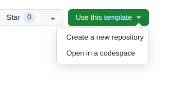

# Welcome to the workshop

Go to <https://opensafely.github.io/dummy-data-workshop> to follow along.

## Prerequisites

### GitHub and Codespaces

We will use a GitHub repository and [Codespaces](https://github.com/features/codespaces)
for this workshop. You will need a personal [GitHub account](https://github.com). Follow the instructions
to [setup your codespace](#setup-your-codespace).

### ehrql 
The ehrQL code that we'll look at in this workshop is not very complicated,
however, it is assumed that you are not *completely* new to ehrQL. If you
need a reminder, please see the [ehrQL checklist](https://docs.opensafely.org/ehrql/reference/cheatsheet) and the 
[ehrql documentation](https://docs.opensafely.org/ehrql).

### R
Some previous experience writing code in R is recommended.

## Setup your codespace

Please go to <https://github.com/opensafely/dummy-data-workshop>

Click on the "Use this template" button, and select "Open in a workspace"

The codespace will take several minutes to launch. Please wait!

!!! Warning
    The codespace will launch with the updated version of ehrQL and R that you need
    for this workshop. You should ignore any terminal reminders to run `opensafely pull`,
    as this will replace the custom R images that we are using. If you need to, you can
    update the R images again by running `update_r` in your codespace terminal.

## Notes

We'll use some icons in parts of this tutorial:

:fontawesome-solid-code: For when we're looking at or modifying some code in a file.

:octicons-terminal-16: For when we need to run a command in the terminal

!!! example "Suggested exercises"
    Blocks like this indication suggested exercises to try, or ways to experiment; we won't
    necessarily have time to go through these during the workshop, but you might want
    to come back to them in the time at the end of the session, or afterwards.
